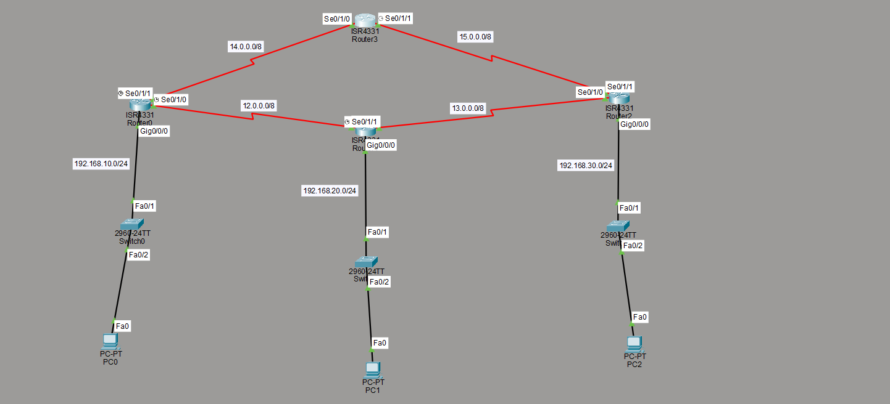
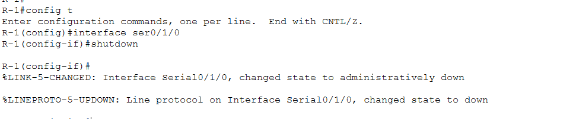
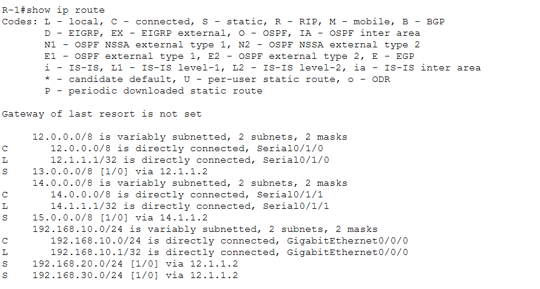
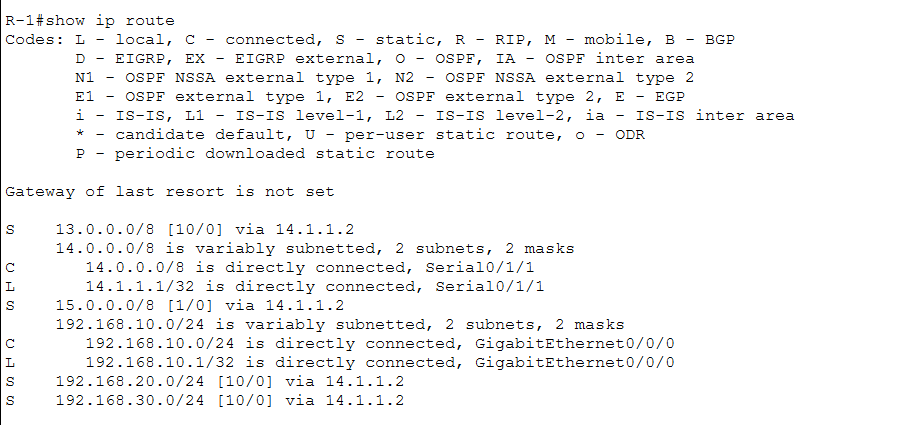
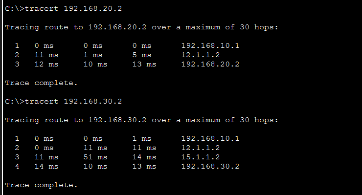
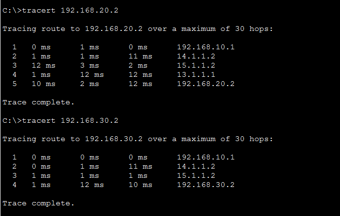
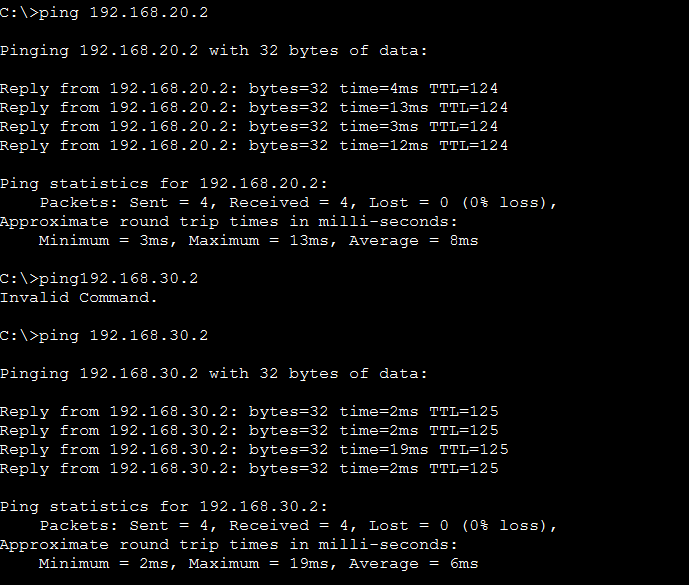

# Floating Static Routing Lab – 4-Router Ring Topology with Failover

## 📌 Overview
This project builds on basic and default static routing by introducing **floating static routes** across a 4-router ring topology. Each router has a primary path and a backup (floating) path to every remote LAN, using Administrative Distance to control preference. The lab was tested by manually failing a WAN link and verifying that traffic automatically rerouted through the backup path — including diagnosing and fixing a real routing loop discovered during testing.

## 🗺️ Network Topology


The network consists of:
- **4 Routers** — R-1, R-2, R-3, R-4, connected in a ring using serial WAN links
- **3 Switches** — connecting PCs at three of the four sites
- **3 PCs**, one per LAN site
- **4 Serial WAN links** forming a ring: R1↔R2, R2↔R3, R3↔R4, R4↔R1 (giving every LAN two possible paths around the ring)

| Site | LAN Subnet | Router | Device |
|------|-----------|--------|--------|
| Site 1 | 192.168.10.0/24 | R-1 | PC0 |
| Site 2 | 192.168.20.0/24 | R-2 | PC1 |
| Site 3 | 192.168.30.0/24 | R-3 | PC2 |
| — | — | R-4 | Transit router only, no LAN |

## 🧮 IP Addressing Table

### LAN interfaces
| Router | Interface | IP Address | Subnet Mask |
|--------|-----------|-----------|-------------|
| R-1 | GigabitEthernet0/0/0 | 192.168.10.1 | 255.255.255.0 |
| R-2 | GigabitEthernet0/0/0 | 192.168.20.1 | 255.255.255.0 |
| R-3 | GigabitEthernet0/0/0 | 192.168.30.1 | 255.255.255.0 |

### WAN (serial) links
| Link | R-1 side | R-2 side | R-3 side | R-4 side | Network |
|------|---------|---------|---------|---------|---------|
| Link 1 | Se0/1/0 — 12.1.1.1 | Se0/1/0 — 12.1.1.2 | — | — | 12.0.0.0/8 |
| Link 2 | — | Se0/1/1 — 13.1.1.1 | Se0/1/0 — 13.1.1.2 | — | 13.0.0.0/8 |
| Link 3 | — | — | Se0/1/1 — 15.1.1.2 | Se0/1/1 — 15.1.1.1 | 15.0.0.0/8 |
| Link 4 | Se0/1/1 — 14.1.1.1 | — | — | Se0/1/0 — 14.1.1.2 | 14.0.0.0/8 |

## ⚙️ Routing Configuration
Every router has a **primary static route** (default AD 1) and a **floating backup route** (AD 10) to each remote LAN, using the ring's alternate path.

**R-1:**
```
ip route 192.168.20.0 255.255.255.0 12.1.1.2
ip route 192.168.20.0 255.255.255.0 14.1.1.2 10
ip route 192.168.30.0 255.255.255.0 12.1.1.2
ip route 192.168.30.0 255.255.255.0 14.1.1.2 10
```

**R-2:**
```
ip route 192.168.10.0 255.255.255.0 12.1.1.1
ip route 192.168.10.0 255.255.255.0 13.1.1.2 10
ip route 192.168.30.0 255.255.255.0 13.1.1.2
ip route 192.168.30.0 255.255.255.0 12.1.1.1 10
```

**R-3:**
```
ip route 192.168.10.0 255.255.255.0 15.1.1.1
ip route 192.168.10.0 255.255.255.0 13.1.1.1 10
ip route 192.168.20.0 255.255.255.0 13.1.1.1
ip route 192.168.20.0 255.255.255.0 15.1.1.1 10
```

**R-4 (transit only, no LAN):**
```
ip route 192.168.10.0 255.255.255.0 14.1.1.1
ip route 192.168.20.0 255.255.255.0 15.1.1.2
ip route 192.168.20.0 255.255.255.0 14.1.1.1 10
ip route 192.168.30.0 255.255.255.0 15.1.1.2
ip route 192.168.30.0 255.255.255.0 14.1.1.1 10
```

> Note: verify the above against your final running-configs before publishing — adjust next-hop addresses if your configuration differs slightly.

## ✅ Verification

**Simulated link failure** — R1–R2 serial link manually shut down:



**Routing table — normal vs. after failover (R-1)** — confirms only primary routes are active before the failure, and floating routes take over once the link goes down:

| Normal | After Failover |
|--------|----------------|
|  |  |

**Traceroute — normal vs. after failover** — proves traffic reroutes through R-4 and R-3 once the primary link is down:

| Normal | After Failover |
|--------|----------------|
|  |  |

**Ping test — after failover** — confirms 0% packet loss is maintained despite the outage:



**Additional screenshots** (running-configs, per-router routing tables for R-2/R-3/R-4 in all three states, normal ping) are available in the [`/screenshots`](./screenshots) folder for anyone who wants the full evidence set:
- `running-config-R-1.png` ... `R-4.png`
- `routing-table-normal-R-2.png`, `R-3.png`, `R-4.png`
- `routing-table-after-failover-R-2.png`, `R-3.png`, `R-4.png`
- `ping-normal.png`

## 🛠️ Troubleshooting: Routing Loop
During failover testing, pings across the failed link initially **timed out** despite floating routes being configured. Investigation of the routing tables revealed a **routing loop between R-2 and R-3**: R-3's only route back to Site 1 pointed to R-2, while R-2's active floating route pointed back to R-3 — causing packets to bounce between them until TTL expired.

**Fix:** R-3's primary route to 192.168.10.0/24 was changed to prefer R-4 (`15.1.1.1`) instead of R-2, with R-2 retained only as the AD-10 backup:
```
no ip route 192.168.10.0 255.255.255.0 13.1.1.1
ip route 192.168.10.0 255.255.255.0 15.1.1.1
ip route 192.168.10.0 255.255.255.0 13.1.1.1 10
```

This highlights a real limitation of static routing in ring topologies: a router only reacts to *its own* directly connected link failing, not a downstream neighbor's failure — which dynamic routing protocols like OSPF solve automatically via link-state awareness.

## 🛠️ Tools Used
Cisco Packet Tracer

## 📂 Repository Contents
- `Lab.pkt` – Packet Tracer project file
- `topology.png` – Network topology diagram
- `running-config-R-1.png` ... `R-4.png`
- `routing-table-normal-R-1.png` ... `R-4.png`
- `routing-table-after-failover-R-1.png` ... `R-4.png`
- `link-failure.png`
- `ping-normal.png`, `tracert-normal.png`
- `ping-after-failover.png`, `tracert-after-failover.png`
- `README.md` – This file

## 👤 Author
Ibraheem

## 📄 License
This project is for educational purposes. Feel free to use or modify it for your own learning.
